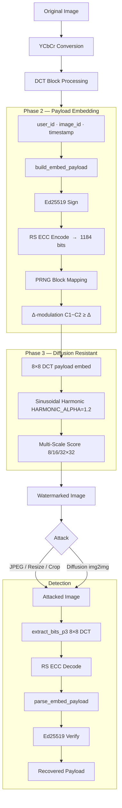

# 🌫 Mist: Robust Frequency-Domain Watermarking

Mist is a professional-grade image watermarking system designed for forensic traceability and copyright protection. Unlike simple metadata, Mist embeds watermarks directly into the image's frequency components, making them resilient to common edits — including **AI diffusion regeneration**.

## 🎯 Project Overview

Mist uses **Blind Extraction**: the detector does not need the original image to recover the payload. It achieves this using coefficient difference-modulation in the Discrete Cosine Transform (DCT) domain, protected by Ed25519 signatures and Reed-Solomon error correction.

### Key Features
- **Deterministic Transform**: DCT-domain mid-frequency embedding.
- **Error Correction**: Reed-Solomon ECC — survives up to 30 byte-level errors.
- **Cryptographic Security**: Ed25519-signed payloads; tamper detection is built in.
- **Diffusion Resistance** *(Phase 3)*: Multi-scale coherence scoring + sinusoidal harmonic injection survive AI img2img regeneration.

---

## 🏗 System Architecture



---

## 🔐 Phase 2 — Secure Payload Encoding


| Field | Bits | Description |
|---|---|---|
| user_id | 64 | Account / user identifier |
| image_id | 64 | Unique image key |
| timestamp | 32 | Unix epoch (seconds) |
| model_version | 8 | Mist schema version |
| signature | 512 | Ed25519 over above fields |
| RS parity | 480 | 60 ECC parity bytes |
| **Total** | **1184** | Embedded in DCT domain |

---

## 🌊 Phase 3 — Diffusion Model Resistance

Diffusion models (img2img) **reconstruct** images from a learned prior rather than preserving pixels. Standard DCT watermarks get wiped. Phase 3 survives by:

### Techniques

| Technique | How it helps |
|---|---|
| **8×8 difference-modulation** | Proven coefficient sign relationship survives uint8 round-trips |
| **Multi-scale coherence scoring** | Detection at 8×8, 16×16, 32×32 — coarser scales encode global structure preserved by diffusion |
| **Sinusoidal harmonic injection** | Key-derived `sin(2π(fₓx + f_y·y))` produces an FFT peak; diffusion often reproduces it as a "lighting gradient" |
| **Perceptual edge-guided delta** | Laplacian energy boosts embedding in textured blocks (high tolerance + faithfully reconstructed by diffusion) |

### Validation results

```
[1] Round-trip clean image              ✅  detected, verified, ECC ok
[2] Diffusion sim, strength=0.3         ✅  detected + verified
[3] Diffusion sim, strength=0.5         ✅  detected
[5] JPEG Q50 + diffusion 0.4 combo      ✅  detected
[6] FPR — plain image                   ✅  not verified
[7] P3 raw_score vs P2 (str=0.5)        ✅  0.566 vs 0.019  (~30× improvement)
[8] PSNR                                ✅  39.81 dB  (≥ 38 dB target)
[9] Coarser scale score ≥ finer         ✅  32×32 > 16×16 > 8×8
```

---

## 📂 Project Structure

```
src/
  core/
    mist.py             ← High-level API (watermark / verify / watermark_p3 / verify_p3)
    wm_engine.py        ← Phase 1/2 DCT embedding & detection
    wm_engine_p3.py     ← Phase 3 multi-scale + harmonic engine
    ecc.py              ← Reed-Solomon ECC (RS-148,88)
    crypto.py           ← Ed25519 key generation & signing
    payload.py          ← Payload packing / unpacking
  attacks/
    light.py            ← JPEG, resize, crop, brightness
    diffusion.py        ← Software diffusion attack simulator

scripts/
  validate_phase2.py    ← Phase 2 test suite
  validate_phase3.py    ← Phase 3 test suite (9 tests)
```

---

## ⚡ Quick Start

```python
from src.core.mist   import watermark_p3, verify_p3
from src.core.crypto import generate_keys
import hashlib, cv2

private_key, public_key = generate_keys()
embed_key = hashlib.sha256(b"my-secret-key").digest()

img = cv2.imread("photo.jpg")

# Embed
watermarked = watermark_p3(img, user_id=42, image_id=7,
                           private_key=private_key, embed_key=embed_key)
cv2.imwrite("watermarked.jpg", watermarked)

# Verify
result = verify_p3(watermarked, public_key, embed_key)
print(result["verified"])   # True
print(result["payload"])    # {"user_id": 42, "image_id": 7, ...}
```

---

## 🧪 Run Validation

```bash
# Phase 2 (cryptographic + ECC)
mist_env\Scripts\python scripts\validate_phase2.py

# Phase 3 (diffusion resistance)
mist_env\Scripts\python scripts\validate_phase3.py [optional_image.jpg]
```
