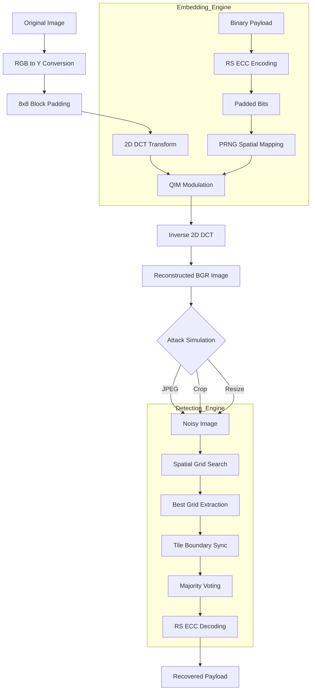
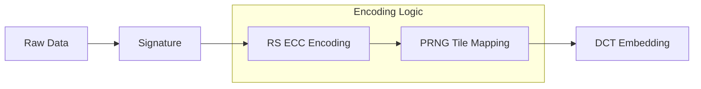

# 🌫 Mist: Robust Frequency-Domain Watermarking

Mist is a professional-grade image watermarking system designed for forensic traceability and copyright protection. Unlike simple metadata, Mist embeds watermarks directly into the image's frequency components, making them resilient to common edits like JPEG compression, resizing, and cropping.

## 🎯 Project Overview

Mist focuses on **Blind Extraction**: the detector does not need the original image to recover the payload. It achieves this using Quantization Index Modulation (QIM) in the Discrete Cosine Transform (DCT) domain.

### Key Features
- **Deterministic Transform**: Uses 2D DCT to target stable mid-frequency bands.
- **Error Correction**: Integrated Reed-Solomon ECC to recover data from noisy or partial images.
- **Synchronization Layer**: 2D Tiling strategy to survive spatial cropping and translation.
- **Cryptographic Security**: Seeded PRNG mapping to prevent pattern analysis and unauthorized removal.

---

## 🏗 System Architecture

The following diagram illustrates the end-to-end lifecycle of a Mist watermark:

---

## 🔐 Phase 2: Secure Payload Encoding

Mist ensures payload integrity and security through a multi-stage encoding pipeline:

### Encoding Tasks
1. **Digital Signature**: RSA/ECC signing for non-repudiation.
2. **Reed-Solomon**: Adds 10 bytes of parity for every 8 bytes of payload.
3. **Adaptive Mapping**: Shuffles bit placement within 6x5 block tiles to resist frequency-analysis attacks.

---

## 🧪 Current Research & Debugging Status

**Status:** Active Debugging – Robustness Regression Under Investigation

### 📌 Summary of Recent Work (2026-03-02)
We recently transitioned from 1D sequence embedding to a **2D Tiling Synchronization Layer** to handle spatial cropping. 

#### Current Metrics (After Recent Fixes)
- **Baseline (No Attack):** 100%
- **Brightness (+15%):** 100%
- **Resize (0.75x):** 100%
- **JPEG (Q50):** ~52% *(Under investigation)*
- **Crop (20%):** ~48% *(Under investigation)*

#### 🔍 Root Cause Analysis
- **PRNG Sync:** Fixed a desynchronization between test-payload generation and tile-mapping logic.
- **Math Precision:** Aligned the Y-channel reconstruction to use `np.clip()` and implicit casting, removing 1-bit quantization noise from `np.round()`.
- **Search Logic:** Extended the spatial grid search to a full 64-pixel sweep, removing premature heuristic exits.

#### 🔄 Next Steps
- Restore JPEG-50 to its previous 100% baseline.
- Validate why isolated diagnostic tests (`debug_detect.py`) achieve 100% while batch tests in `test_phase_e.py` fall to 50%.

---
